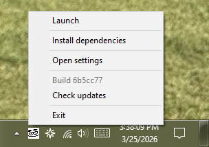
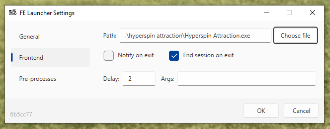

# FE Launcher
A portable arcade frontend session manager for Windows 10+. For use with HyperSpin, AttractMode, etc.

 

## Overview
*FE Launcher* is a rock-solid session manager that provides a variety of functionality allowing users to turn a Windows PC into a managed arcade machine.

It acts as a wrapper layer around any modern arcade frontend of choice, allowing you to launch pre-processes, run Lua hooks, and manage sessions on an OS level. If a pre-process or its children unexpectedly terminates, *FE Launcher* can automatically end or restart the session.

## Features
- Reliably launch pre-processes and frontend process as a tracked session
- End sessions with the click of a button, or control when the session should end gracefully
- Script custom pre/post-session hooks with an integrated Lua interpreter
- Add custom scripts to tray menu for easy user access, e.g., a dependency installer

## Installation
> [!IMPORTANT]
> *FE Launcher* is intended for recent versions of Windows 10 (1809+) and Windows 11.

*FE Launcher* is as a completely portable system tray application, distributed as a single binary. It is recommended to place the executable at the root of your arcade drive.

Upon first startup, *FE Launcher* will create a folder named `felauncher` in the current directory. This folder will contain the log and settings files, and a `hooks` directory for scripts.

> [!NOTE]
> `felauncher.exe` requires administrator privileges to allow seamless process launching without UAC prompts and to manage startup tasks via Task Scheduler.

## Development
The solution consists of 6 projects:

| Project | Description |
| ------- | ----------- |
| `FELauncher.Host` | Entrypoint/lifetime; encapsulates generic host, bootstraps core functionality, and registers DI services |
| `FELauncher.Shared` | Shared contracts and constants |
| `FELauncher.Engine` | The core implementation of the app's features |
| `FELauncher.UI.Shell` | Native system tray menu and Windows 10 notification functionality |
| `FELauncher.UI.Desktop` | WPF settings GUI |
| `FELauncher.Tests` | Unit tests |

### Building
Releases are built by publishing the `FELauncher.Host` project with the included `x64.pubxml` profile.

To publish with cli:
```shell
dotnet publish src/FELauncher.Host/FELauncher.Host.csproj -p:PublishProfile=x64
```

This will output the executable `felauncher.exe` located in the build folder `bin/x64/`.

### Testing
Unit tests are located in the `FELauncher.Tests` project. `xUnit` is used for testing.

To run all tests:
```shell
dotnet test
```

## Roadmap
### v0.1
1. Ensure current feature set works as expected.
2. Write user documentation

### Future Goals
1. Support CIFS login with Credential Manager and provide Lua API for managing symlinks in scripts.
2. Add support for multiple sessions.
3. Implement a sleep timer: e.g., Wait `x` minutes before ending session and shutting down or sleeping Windows.
